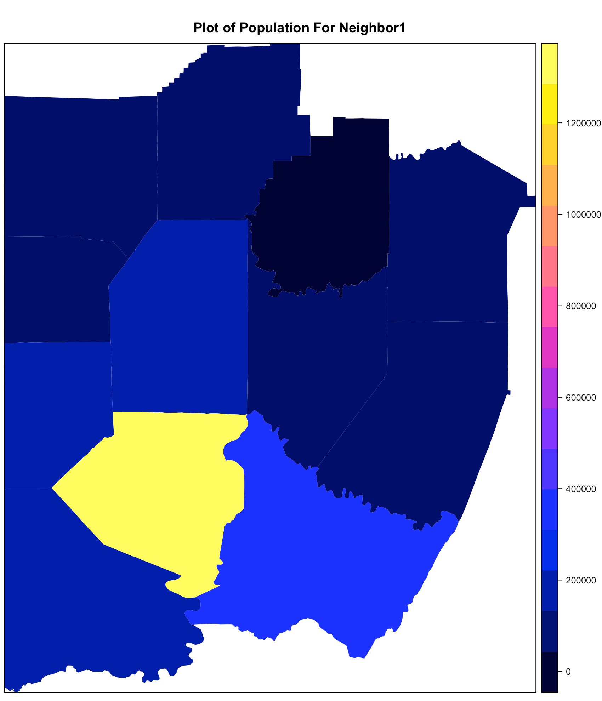
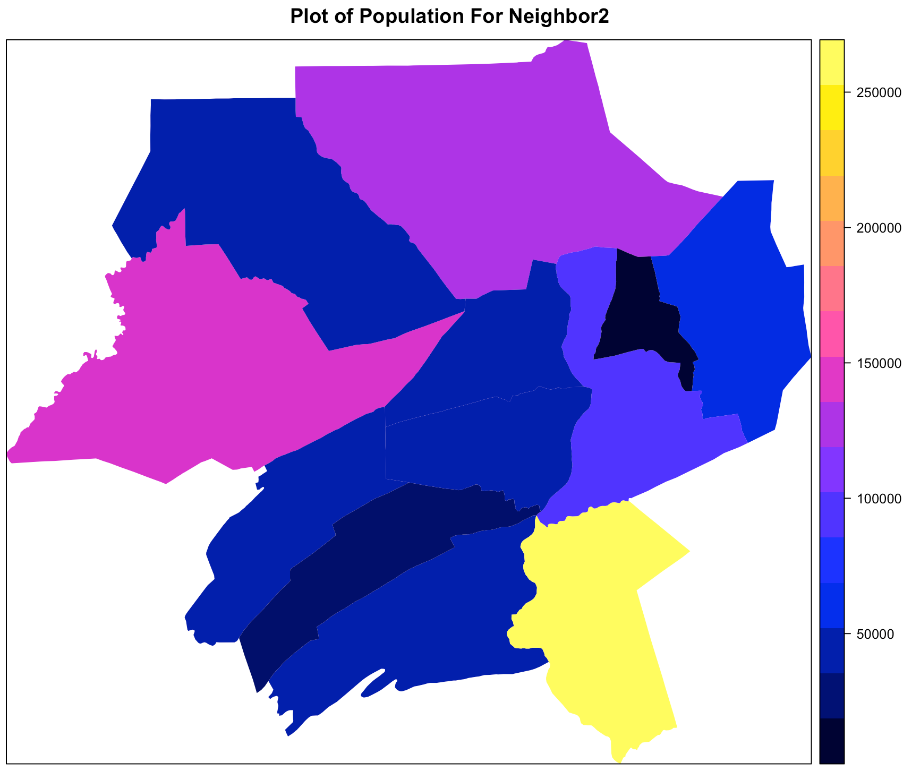
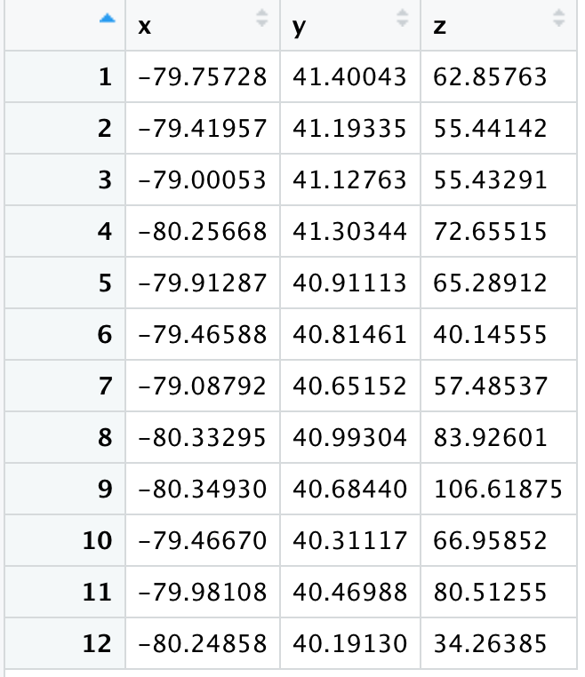
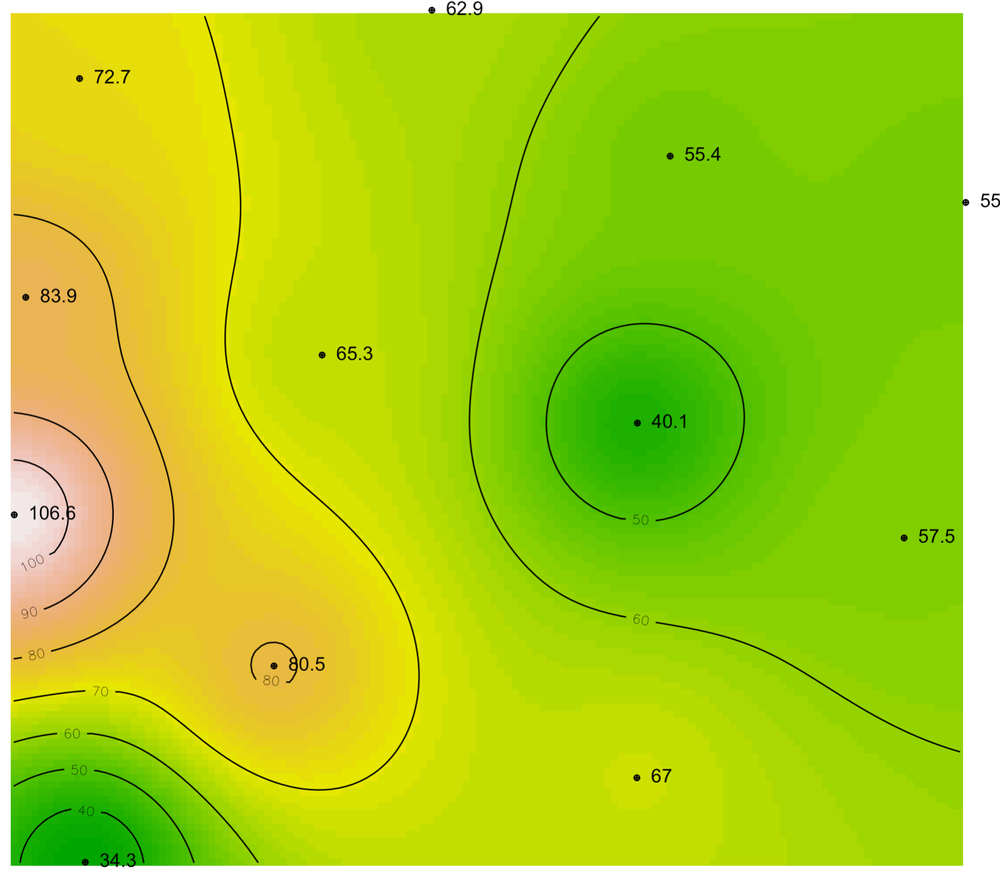
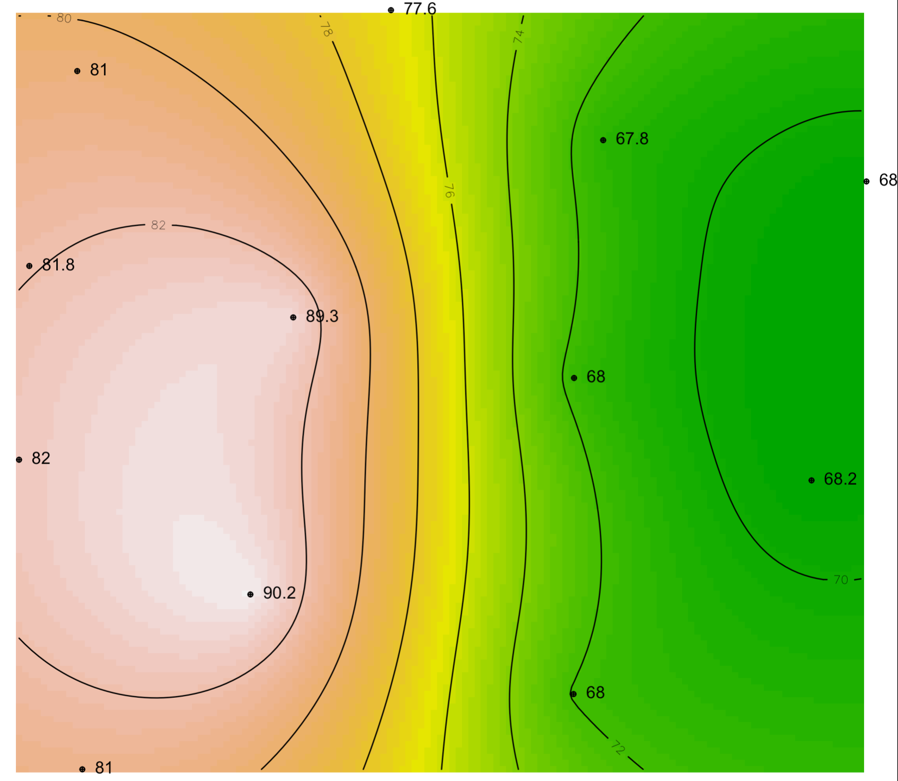
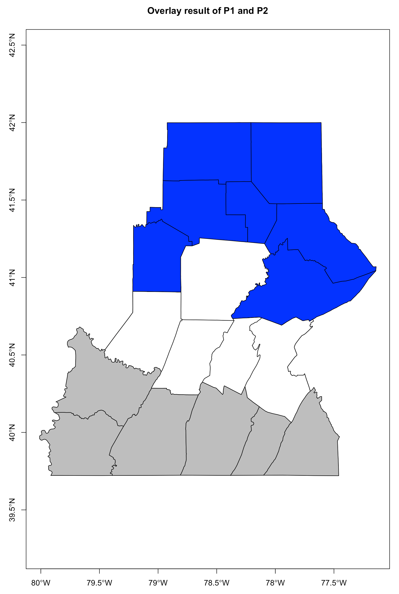
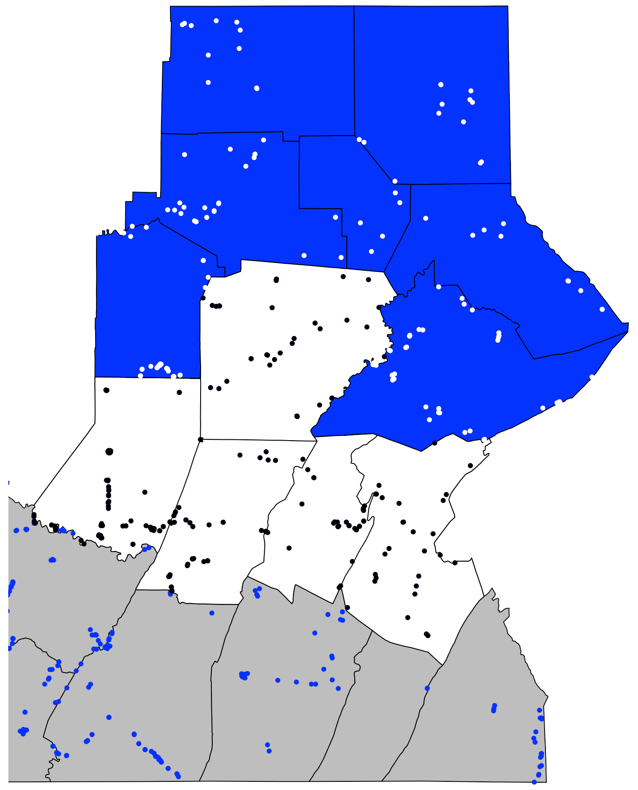
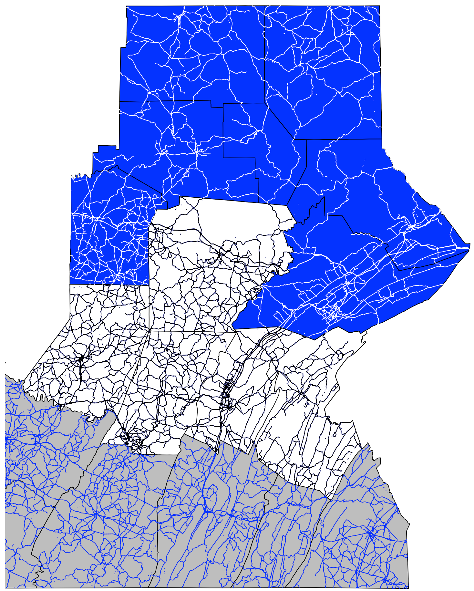

##Final Report

Sichao Wang(SIW32@pitt.edu) 

### Part A

1. The main difference of Rook’s and Queen’s adjacencies is the way to choose  adjacent polygons. The Rook, will choose the polygons share borders of some length with it, while the Queen will select any polygon that shares even a point-length border with it.

2. The equation of Moran'S I(from Wiki):
   $$
   I=\frac{N}{W} \frac{\sum_{i} \sum_{j} w_{i j}\left(x_{i}-\bar{x}\right)\left(x_{j}-\bar{x}\right)}{\sum_{i}\left(x_{i}-\bar{x}\right)^{2}}
   $$
   The equation of  Geary’s C:
   $$
   C=\frac{(N-1) \sum_{i} \sum_{j} w_{i j}\left(x_{i}-x_{j}\right)^{2}}{2 W \sum_{i}\left(x_{i}-\bar{x}\right)^{2}}
   $$
   For these two equations, $N$ is the number of spatial units indexed by $i$ and $j$;  $x$ is the variable of interest; $\bar{x}$ is the mean of $x$; $w_{ij}$ is a matrix of spatial weights with zeroes on the diagonal; and $W$ is the sum of all $w_{ij}$.

   For the Moran's I is basically based on the covariance. This equation could indicate how close the data points to the overall mean of that dataset. 

   While the numerator of Geary's C is basically a result of sum of square error of all pairs of any two areas. Since this numerator will always be positive, we should compare the result with value 1 to tell whether the autocorrelation is positive or not. 

3. The importance of local statistics is basically:

   - Due to the importance of geographic variation in phenomena, the single global process is not always very plausible.
   - Local statistics would help to understand the local contexts in  the global patterns of phenomena.

   Getis-Ord $G_i$, 
   $$
   G_{i}=\frac{\sum_{j \neq i} w_{i j} x_{j}}{\sum_{j \neq i} x_{j}}
   $$
   Getis-Ord $G^*_i$, 
   $$
   G_{i}^{*}=\frac{\sum_{j} w_{i j} x_{j}}{\sum_{j} x_{j}}
   $$
   Based on the equations,  the most difference is $G_i$ exclusively consider the $x_i$ itself, while $G^*_i$ take it into account.

4. Global G statistic,
   $$
   G(d)=\frac{\sum_{i=1}^{n} \sum_{j=1}^{n} w_{i j}(d) x_{i} x_{j}}{\sum_{i=1}^{n} \sum_{j=1}^{n} x_{i} x_{j}} \quad \text { for all } i \neq j
   $$
   The Global G statistic take all the data points in the study area into account, it could figure out the hot/cold spot over the study area. While the Getis-Ord only consider the neighbors, its result will be varied according to the neighbors' values, it could not get the global information.

5. TIN represent continuous surfaces based on a point sample. Sample points are connected to form triangles, and the relief inside each triangle is represented as a plane or facet. In a vector GIS, TINs can be stored as polygons, each with three sides and with attributes of slope, aspect, and the heights of the three vertices. TIN usually could describe a surface using less points than that of DEM.

6. The equation of inverses Distance Weighting 

   $$
   \hat{z}_{j}=\sum_{i=1}^{m} w_{i j} z_{i}
   $$

​	Where the $w_{ij}$  follow this equation
$$
w_{i j}=\frac{1 / d_{i j}}{\sum_{i=1}^{m} 1 / d_{i j}}
$$
​	So using the interpolation, we could use IDW to determine the mean. And for a set of control points, this techniques could be used in following steps: First, lay a grid of points over the area. Then calculate the interpolated value for each point. Contouring the interpolated values to produce a surface representation.

7. Equation
   $$
   2 \hat{\gamma}(d)=\frac{1}{n(d \pm \Delta / 2)} \sum_{d \pm \Delta / 2}\left(z_{i}-z_{j}\right)^{2}
   $$
   The reason for using distance bins is, for a given distance $d$, usually, there will be no pair of observations at precisely that separation, instead of estimating continuously at all distance, we will make estimates for distance bins.

8. Steps of ordinary Kriging interpolation:

   - Producing a description of the spatial variation in the sample control point data.
   - Summarizing this spatial variation by a regular mathematical function.
   - Using this model to determine interpolation weights.

9. Steps of overlaying:

   * Get the data from two maps and decide what to include in the maps.
   * Make the two maps to be registered on the same coordinate system.
   * Create a new map of polygon objects by finding intersection of two maps
   * Combine polygons in the original maps to form new polygons
   * Keep the new map remain planar and reestablish the topological relationships

10. Local minimum

  

  Local Minimum of A :

  

  Focal median On B:

  

   

### Part B



|           | Moran’s I(queen) | Moran’s I(rook) | Geary's C(queen) | Geary's C(rook) |
| :-------- | :--------------- | :-------------- | :--------------- | :-------------- |
| Neighbor1 | 0.0501523        | 0.1008170       | 0.8867200        | 0.8208059       |
| Neighbor2 | -0.2061743       | -0.1161364      | 0.9984425        | 0.9105008       |

Result Analysis:

Generally, in these two dataset, every polygons are independent from each other, and from the plot, it follow the Tobler's Law that the adjacent polygons are more likely to have same level population but not exactly same.

For neighbor1, the Moran's I > 0 but <0.3 for both methods, which indicates a weak positive autocorrelation, and the Geary's C values are greater than 0 and less than 1, which support this conclusion.

Fort neighbor2, the Moran's I > -0.3 and < 0, which indicates a weak negative autocorrelation, while the Geary's C are greater than 0 and less than 1, which is the opposite, are a positive autocorrelation. We could not draw a conclusion from these values.

The effect of observing spatial autocorrelation in a dataset (such as the one you used above) on using regression statistics.

### Part C

#### IDW result


#### OK result



#### IDW Map



#### OK Map



For the R and K value, when R=1.5 and K=1, the result of IDW and OK is most similar, or close since I use cosine similarity to compare. But two maps still differ from each other. The OK map, the high values clustered in left side and low values in right side, and the IDW map, looks like a hill, the high value clustered in the middle.

For this dataset, I think the OK is more suitable. As we can see the result of IDW, some points has a highly fluctuating value when R and K vary, like the first points, from 0 to 61. While the OK use all the control points and statistical medal to show the semi variance, and the output is more trustable.


### Part D



The white part is the intersection of P1 and P2, $P_{12}$,  the blue part is $P^{'}_1$ and the grey part is $P^{'}_2$.



Left figure above shows $P_3$ points in $P_1$, $P_2$, and $P_{12}$. Specifically, the white and black points are those with in $P_1$, black and blue points are those with in$P_2$, and the blue points are with in $P_{12}$.

Right figure above $P_4$ road segments in $P_1$, $P_2$, and $P_{12}$. The meaning of color is same as the point figure.

|                      Item                      |   Value    |
| :--------------------------------------------: | :--------: |
|       Number of Points of P3 with in P1        |    426     |
|       Number of Points of P3 with in P2        |    567     |
|       Number of Points of P3 with in P12       |    280     |
| Total length of road segments of P4 within P1  | 35,953,473 |
| Total length of road segments of P4 within P2  | 48,742,432 |
| Total length of road segments of P4 within P12 | 20,184,893 |
|                  Area of P12                   |  1.62248   |

### Code

```R
##### Part B #####

# import data
Neighbor1 <- readOGR(dsn=wd,"1_Neighbor1")
Neighbor2 <- readOGR(dsn=wd,"1_Neighbor2")


spplot(Neighbor1, "POP_ARR02", main = "Plot of Population For Neighbor1", col = "transparent") # Plot of Population for Neighbor1
spplot(Neighbor2, "POP_ARR02", main = "Plot of Population For Neighbor2", col = "transparent") # Plot of Population for Neighbor2

# self implemented MoranI
moranXi<-function (values, Weights) { 
  y <- values 
  w <- Weights 
  n <- length(y) 
  m <- mean(y)  # mean 
  sum <- rowSums(w)  # summ of all values 
  sum[sum == 0] <- 1   # if sum is 0 it is 1 
  w <- w/sum                      # new weigh is wight / by sum 
  DL<-0; 
  for(i in 1:n){ 
    DL<-DL+(y[i]-m)^2 }  # value - mean square 
  I<-n/DL               
  NR<-0 
  DR<-0 
  for(i in 1:n){ 
    for(j in 1:n){ 
      NR=NR+w[i,j]*(y[i]-m)*(y[j]-m) 
      DR<-DR+w[i,j] } } 
  I<-I*NR/DR 
  I<-as.numeric(I) 
  data.frame(moran=I) 
}

# self implemented GearyC
gearyXc <- function(values, Weights) {
  y <- values
  w <- Weights
  n <- length(y)
  m <- mean(y)
  DL <- 0;
  for(i in 1:n){
    DL <- DL + (y[i]-m)^2;
  }
  L <- (n-1)/DL
  NR <- 0;
  DR <- 0;
  for(i in 1:n){
    for(j in 1:n){
      NR <- NR + w[i,j]*(y[i]-y[j])^2
      DR <- DR + 2*w[i,j]
    }
  }
  C<-L*NR/DR
  return(C)
}
table <- data.frame(matrix(NA, 2,4))
names(table) <- c('Moran’s I(queen)', 'Moran’s I(rook)', "Geary's C(queen)", "Geary's C(rook)")
row.names(table) <- c("Neighbor1","Neighbor2")

# Neighbor1
Neighbor1$POP_ARR02 <- as.numeric(as.character(Neighbor1$POP_ARR02))
Neighbor1.rook <- poly2nb(Neighbor1,queen=FALSE)
Neighbor1.queen <- poly2nb(Neighbor1,queen=TRUE)
Neighbor1.matrix.queen <- nb2mat(Neighbor1.queen)
Neighbor1.matrix.rook <- nb2mat(Neighbor1.rook)

# Calculation of Moran's I
Neighbor1.mi.queen <- moranXi(Neighbor1$POP_ARR02, Neighbor1.matrix.queen)
Neighbor1.mi.rook <- moranXi(Neighbor1$POP_ARR02, Neighbor1.matrix.rook)
# Calculation of Geary's C
Neighbor1.gc.queen <- gearyXc(Neighbor1$POP_ARR02, Neighbor1.matrix.queen)
Neighbor1.gc.rook <- gearyXc(Neighbor1$POP_ARR02, Neighbor1.matrix.rook)

table["Neighbor1", "Moran’s I(queen)"] = Neighbor1.mi.queen
table["Neighbor1", "Moran’s I(rook)"] = Neighbor1.mi.rook
table["Neighbor1", "Geary's C(queen)"] = Neighbor1.gc.queen
table["Neighbor1", "Geary's C(rook)"] = Neighbor1.gc.rook

# Neighbor2
Neighbor2$POP_ARR02 <- as.numeric(as.character(Neighbor2$POP_ARR02))
Neighbor2.rook <- poly2nb(Neighbor2,queen=FALSE)
Neighbor2.queen <- poly2nb(Neighbor2,queen=TRUE)
Neighbor2.matrix.queen <- nb2mat(Neighbor2.queen)
Neighbor2.matrix.rook <- nb2mat(Neighbor2.rook)

# Calculation of Moran's I
Neighbor2.mi.queen <- moranXi(Neighbor2$POP_ARR02, Neighbor2.matrix.queen)
Neighbor2.mi.rook <- moranXi(Neighbor2$POP_ARR02, Neighbor2.matrix.rook)
# Calculation of Geary's C
Neighbor2.gc.queen <- gearyXc(Neighbor2$POP_ARR02, Neighbor2.matrix.queen)
Neighbor2.gc.rook <- gearyXc(Neighbor2$POP_ARR02, Neighbor2.matrix.rook)

table["Neighbor2", "Moran’s I(queen)"] = Neighbor2.mi.queen
table["Neighbor2", "Moran’s I(rook)"] = Neighbor2.mi.rook
table["Neighbor2", "Geary's C(queen)"] = Neighbor2.gc.queen
table["Neighbor2", "Geary's C(rook)"] = Neighbor2.gc.rook

##### Part C #####
Community <- readOGR(".", "2_Community") # import the data
ControlPoints <- as.data.frame(Community@data[, c(5 : 7)]) # get the observed value at control points
names(ControlPoints) <- c("x", "y", "z") # rename column
row.names(ControlPoints) <- seq(1:nrow(ControlPoints)) # rename row index
InterpolatePoints <- as.data.frame(coordinates(Community)) # get the x and y of centroids for each polygon
names(InterpolatePoints) <- c("x", "y") # rename column
row.names(InterpolatePoints) <- seq(1:nrow(InterpolatePoints)) # rename row index
# Inverse Distance Weighting
idw.r.k <- function(r, k) { # change r and k
  Result.IDW <- NULL
  for (i in 1:length(InterpolatePoints$x)) { # iterate the interpolatPoints
    Distance <- NULL # initial the distance 
    Distance = sqrt((InterpolatePoints$x[i]-ControlPoints$x)^2+(InterpolatePoints$y[i]-ControlPoints$y)^2) # calculate the euclidian distance
    ControlPoints.r <- ControlPoints
    ControlPoints.r <- cbind.data.frame(ControlPoints.r, Distance)
    ControlPoints.r <- ControlPoints.r[ControlPoints.r$Distance <= r,] #filter the control points by r
    ControlPoints.r$Distance.k <- ControlPoints.r$Distance^k # give the exponent k
    ControlPoints.r$InverseDistancek <- 1/ControlPoints.r$Distance.k # inverse
    ControlPoints.r$Weight <- ControlPoints.r$InverseDistancek / sum(ControlPoints.r$InverseDistancek) # normalize the weight
    ControlPoints.r$WeightedValue = ControlPoints.r$Weight * ControlPoints.r$z # w*z
    result <- sum(ControlPoints.r$WeightedValue) # get the interpolate value
    Result.IDW <- c(Result.IDW, result) # save the result
  }
  return(Result.IDW)
}
IDW.rk1 <- idw.r.k(0.1,1)
IDW.rk2 <- idw.r.k(0.5,1)
IDW.rk3 <- idw.r.k(1.0,1)
IDW.rk4 <- idw.r.k(1.5,1)
IDW.rk5 <- idw.r.k(0.1,2)
IDW.rk6 <- idw.r.k(0.5,2)
IDW.rk7 <- idw.r.k(1.0,2)
IDW.rk8 <- idw.r.k(1.5,2)
IDW.rk9 <- idw.r.k(0.1,3)
IDW.rk10 <- idw.r.k(0.5,3)
IDW.rk11 <- idw.r.k(1.0,3)
IDW.rk12 <- idw.r.k(1.5,3)


### OK
ControlPoints.sp = ControlPoints
coordinates(ControlPoints.sp) = ~x+y 
ControlPoints.variogram <- autofitVariogram(z~1, ControlPoints.sp, model = "Exp") 
plot(ControlPoints.variogram)
# use the parameter result to create gamma function
gamma <- function(d) {
  g = 2967 + 5574 * (1 - exp(-d/0.12))
  return(g)
}
# Create the Distance Matrix D for all control points
D <- as.data.frame(matrix(data = NA, nrow = nrow(ControlPoints), ncol = nrow(ControlPoints)))
for (i in 1:nrow(D)) {
  for (j in 1:nrow(D)) {
    D[i,j] = sqrt((ControlPoints$x[i] - ControlPoints$x[j])^2 + (ControlPoints$y[i] - ControlPoints$y[j])^2) # Euclidean Distance
  }
}

A <- gamma(D)
A <- rbind.data.frame(A, 1)
A <- cbind.data.frame(A, 1)
diag(A) <- 0
names(A) <- c(seq(1:13))
A.inverse <- solve(A)
Result.OK <- NULL
for (i in 1:nrow(InterpolatePoints)) {
  d <- NULL # initial the vector d
  d <- sqrt((InterpolatePoints$x[i]-ControlPoints$x)^2+(InterpolatePoints$y-ControlPoints$y)^2)
  b <- c(gamma(d), 1) # calculate matrix b
  w <- A.inverse %*% b # calculate weight matrix w
  z <- sum(ControlPoints$z * w[1:nrow(w)-1]) # interpolate
  Result.OK <- c(Result.OK, z)
}
Result.OK

cosine(Result.OK, IDW.rk1) # 0.4384203
cosine(Result.OK, IDW.rk2) # 0.6957157
cosine(Result.OK, IDW.rk3) # 0.9457951
cosine(Result.OK, IDW.rk4) # 0.9694012
cosine(Result.OK, IDW.rk5) # 0.4277558
cosine(Result.OK, IDW.rk6) # 0.6831193
cosine(Result.OK, IDW.rk7) # 0.8738606
cosine(Result.OK, IDW.rk8) # 0.8987295
cosine(Result.OK, IDW.rk9) # 0.4236966
cosine(Result.OK, IDW.rk10) # 0.6798314
cosine(Result.OK, IDW.rk11) # 0.8406551
cosine(Result.OK, IDW.rk12) #  0.8597736
#so the most similar parameter are 1.5 1

ResultTable <- cbind.data.frame(InterpolatePoints,IDW.rk4)
names(ResultTable) <- c("x", "y", "z")
IDW.map<-as.data.frame(ResultTable)
coordinates(IDW.map)=~x+y
xRange<-as.numeric(bbox(IDW.map)[1,])
yRange<-as.numeric(bbox(IDW.map)[2,])
grid<-expand.grid(x = seq(from = xRange[1], to =xRange[2], by = 0.01),
                  y = seq(from = yRange[1],to = yRange[2], by = 0.01))
coordinates(grid) <- ~x + y
gridded(grid) <- TRUE
IDW.data <- gstat::idw(ResultTable$z ~ 1, locations=IDW.map, newdata=grid)
IDWPlot<- par(mar=c(0,0,0,0))
image(IDW.data,"var1.pred",col=terrain.colors(50))
contour(IDW.data,"var1.pred", add=TRUE, nlevels=10)
plot(IDW.map, add=TRUE, pch=10, cex=0.5)
text(coordinates(Community),
     as.character(round(ResultTable$z,1)), 
     pos=4, cex=0.8, col="black")
map.axes(cex.axis=0.8)
par(IDWPlot)


OK.result <- cbind.data.frame(InterpolatePoints, Result.OK)
names(OK.result) <- c("x", "y", "z")
coordinates(OK.result) = ~ x + y
variogram <- autofitVariogram(z ~ 1, OK.result, model = "Exp")
variogram
plot(variogram)
nugget = 41
sill = 89
range = 1.1
model <- vgm(psill = sill, model = "Exp", range = range, nugget = nugget)
krige <- krige(OK.result$z ~ 1, OK.result, grid, model = model)
OKPlot <- par(mar = c(0, 0, 0, 0))
image(krige ,"var1.pred",col=terrain.colors(50)) 
contour(krige ,"var1.pred", add=TRUE, nlevels=10) 
plot(OK.result, add=TRUE, pch=10, cex=0.5)
text(coordinates(OK.result), 
     as.character(round(OK.result$z, 1)),
     pos=4, 
     cex=0.8,
     col="black")
map.axes(cex.axis=0.8)
par(OKPlot)


##### Part D #####

## load data
P1 <- readOGR(".", "3_Area1")
P2 <- readOGR(".", "3_Area2")
P3 <- readOGR(".", "3_TrailPoints")
P4 <- readOGR(".", "3_State_Roads")

# question a.
crs(P1)
crs(P2)
plot(union(P1,P2),axes=TRUE,main="Overlay result of P1 and P2")
plot(P1, add=TRUE, col="blue")
plot(P2, col="Grey",add=TRUE)
P1. = erase(P1, P2)
P12 = erase(P1, P1.)
plot(P12, col="white",add=TRUE)

# question b
crs(P3)
P3.new <- spTransform(P3, crs(P1))

#p3 in p1
P3inP1 <- intersect(P3.new, P1)
length(P3inP1) # 426 points

# p3 in p2
P3inP2 <- intersect(P3.new, P2)
length(P3inP2) # 567 points

# p3 in P12
P3inP12 <- intersect(P3.new, P12)
length(P3inP12) # 280 points

#combine result
plot(P1, col = "blue", main = "P3 points in P1, P2 and P12")
plot(P2, col = "grey", add = TRUE)
plot(P12, col = "white", add = TRUE)
plot(P3inP1, col="white", add = TRUE, pch = 20)
plot(P3inP2, col="blue",add = TRUE, pch = 20)
plot(P3inP12,add = TRUE, pch = 20)

# question c
crs(P4)
P4.new <- spTransform(P4, crs(P1))
P4inP1 <- intersect(P4.new, P1)
sum(P4inP1$SEG_LNGTH_)

P4inP2 <- intersect(P4.new, P2)
sum(P4inP2$SEG_LNGTH_)

P4inP12 <- intersect(P4.new, P12)
sum(P4inP12$SEG_LNGTH_)


plot(P1, col = "blue", main = "P4 Road segments in P1, P2 and P12")
plot(P2, col = "grey", add = TRUE)
plot(P12, col = "white", add = TRUE)
plot(P4inP1, col="white", add = TRUE, pch = 20)
plot(P4inP2,col="blue",add = TRUE, pch = 20)
plot(P4inP12,add = TRUE, pch = 20)

P12_aere = sum(P12$Area)

```


